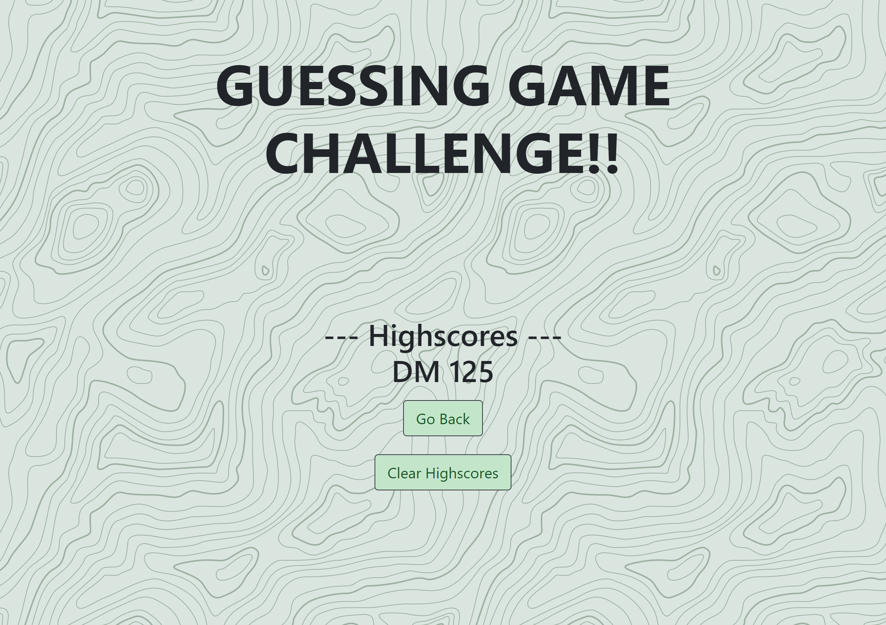

# Guessing-Game

## Description

    Throughout this Bootcamp we have learned a lot and this week it was time to put it all together!! This week our task was to construct a timed coding quiz with multiple-choice questions. This app runs in the browser, and features dynamically updated HTML and CSS powered by JavaScript code that we wrote and needed to include a clean, polished, and responsive user interface.

    The importance of completing this task lies in what we will experience in our journey to becoming full-stack web developers. It is likely that during an interview process we will be asked to complete a coding assessment. Typically these coding assessments are a combination of multiple-choice questions and interactive coding challenges. So to help us become familiar with these tests this week's task allows us to get a glimpse of what we can expect to face in the real world! 
    
## User Story

```
AS A coding boot camp student
I WANT to take a timed quiz on JavaScript fundamentals that stores high scores
SO THAT I can gauge my progress compared to my peers
```

## Tasks Completed

    **List of Tasks Completed**

    1. Created Github Repository with ReadMe file.

    2. Created index.html, script.js, and style.css files.

    3. Created jumbotron for title of game and start button on the first screen that appears.

    4. Created additional divs for questions to appear upon click, score and submit score button on quiz end, and highscores section to save your highscore upon submitting.

    5. Styled body, jumbotron, card-body, startBtn, questions section, and scores sectiong with css to give appealing look to game.

    6. Using javascript made start button functional to where game and timer begin upon click.

    7. After click on start button, used javascript to make additional questions appear after each is answered correctly or incorrectly.

    8. When questions are answered correctly 25 points are added to the score and the score is displayed.

    9. When questions are answered incorrectly 10 seconds is deducted from the timer. 

    10. Upon completion of the quiz or completion of the timer, the game ends and a field appears to enter your initials and submit your highscore.

    11. Upon clicking submit you can then click on "Click here to see highscores" link to see highscores.

    12. Steps 8 through 12 were made possible by creating multiple functions within js file and variables to grab elements from html file as well as a few if and else statements. 

## Link to Deployed Application & Screenshots of Completed Application

    **Live Link**
[Guessing Game](https://dspark8916.github.io/Guessing-Game/)

    **ScreenShots**


