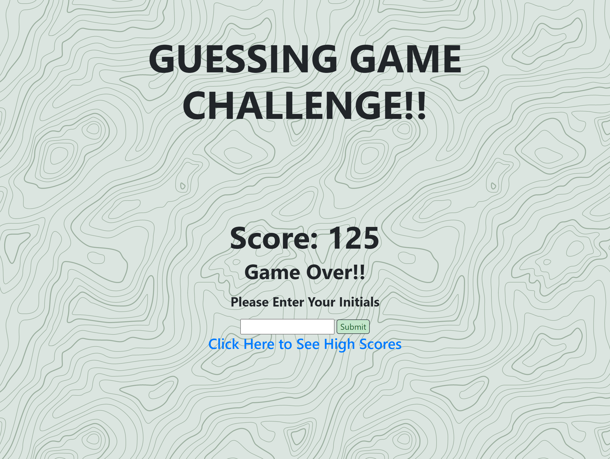

# Guessing-Game

## Description

    Throughout this Bootcamp we have learned a lot and this week it was time to put it all together!! This week our task was to construct a timed coding quiz with multiple-choice questions. This app runs in the browser, and features dynamically updated HTML and CSS powered by JavaScript code that we wrote and needed to include a clean, polished, and responsive user interface.

    The importance of completing this task lies in what we will experience in our journey to becoming full-stack web developers. It is likely that during an interview process we will be asked to complete a coding assessment. Typically these coding assessments are a combination of multiple-choice questions and interactive coding challenges. So to help us become familiar with these tests this week's task allows us to get a glimpse of what we can expect to face in the real world! 
    
## User Story

```
AS A coding boot camp student
I WANT to take a timed quiz on JavaScript fundamentals that stores high scores
SO THAT I can gauge my progress compared to my peers
```

## Tasks Completed

    **List of Tasks Completed**

    1.

    2.

    3.

    4.

    5.

    6.

    7.

    8.

    9.

    10.

## Link to Deployed Application & Screenshots of Completed Application

    **Live Link**
[Guessing Game](https://dspark8916.github.io/Guessing-Game/)

    **ScreenShots**




